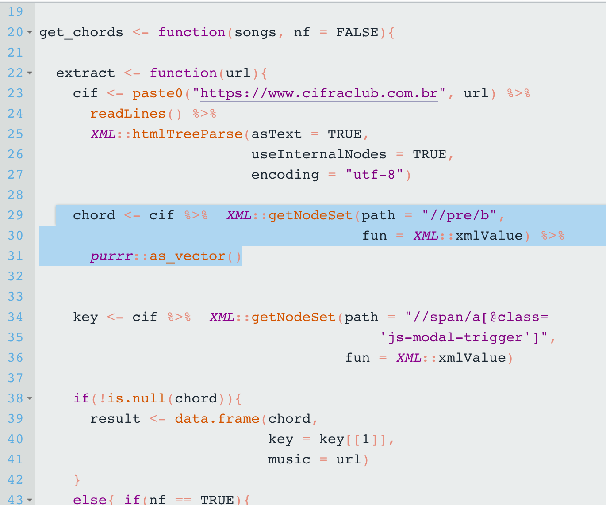
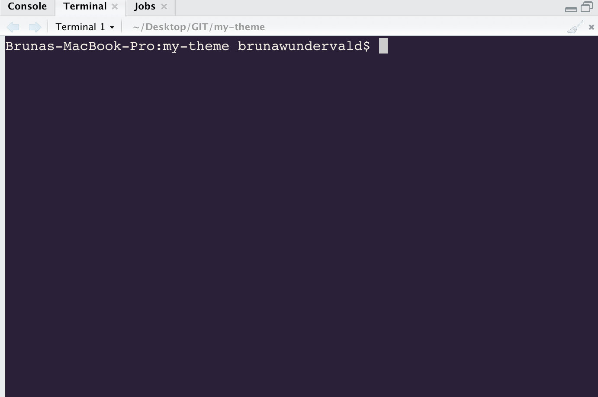

# my-theme
My current RStudio theme :) because I like mixing pastel colors 
with strong ones.

# Examples

## Installation

  1. Ensure you have the latest version of RStudio (at least v1.2, which was [released in April of 2019](https://blog.rstudio.com/2019/04/30/rstudio-1-2-release/))
  2. Run in `R`:
`rstudioapi::addTheme("https://raw.githubusercontent.com/brunaw/my-theme/master/my-theme.rstheme", TRUE, TRUE, FALSE)`

### Change Theme

To change your current theme, you can select your desired theme by going to `Tools > Global Options > Appearance > Editor theme`

### Uninstallation

To uninstall this theme, just run in `R`:

`rstudioapi::removeTheme("my-theme")`
